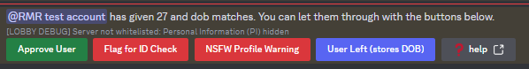

<h1>Lobby Information</h1>
The lobby's main function is to verify the user based on their age and date of birth. This is done by the bot automatically
when the user joins the server. When the user inputs their date of birth, the bot will send a message to the lobby moderation
where the staff can easily approve the user. The bot will automatically check the user's age and date of birth against the
database and if the user is on the ID list. If the user is on the ID list, the bot will automatically flag the user and
inform the staff.

## Lobby Buttons



When someone provides the correct age and date of birth, the bot will pop up with the following message (if your server is whitelisted, it will show the dob.). These buttons perform the following actions:
* **Approve user**: The user is welcomed in the main server, their roles changed and added to the database. 
* **Flag for ID Check**: If a user gives multiple date of births, or performs other actions that may be cause for concern, you can flag the user for an ID check for admins to handle.
* **NSFW Profile Warning**: If a user has NSFW content in their profile which violates discord ToS, you can use this button to remind them to change it. When used it will send the following to the user:
```**NSFW Warning**\n
  Hello, this is the moderation team for {guild name}. As Discord TOS prohibits NSFW content anywhere that can be accessed without an age gate, we will have to ask that you inspect your profile and remove any NSFW content. This includes but is not limited to:
* NSFW profile pictures
* NSFW display names
* NSFW Biographies
* NSFW status messages
* NSFW Banners
* NSFW Pronouns
* and NSFW game activity.

Once you've made these changes you may resubmit your age and date of birth. Thank you for your cooperation.
```
* **User Left (Stores DOB)**: If a user leaves before you can approve them, you can use this button to store their information so that it can be used in the future if they return! 


### Lobby automod:

* Invite info: When a user joins the server, the bot will automatically send a message with the invite info.
* on join send button: When a user joins the server, the bot will automatically send a message with a button to verify
  their age.
* Check age: When a user verifies their age, the bot will automatically check if the user is on the ID list, if their
  age and dob match and if there is a previous entry in the database. If one of the mentioned checks fails, the bot will
  notifiy the staff.
* clean up: When a user is approved by staff, the bot will automatically remove the message with the button and the
  user's
  message.
* welcome message: When a user is approved by staff, the bot will automatically send a welcome message in the general
  chat.

### `/button`

**Description:** Creates a permanent verification button for the lobby; initiates the whole process.

**Permissions:** `administrator`

**Usage:** /button text:<text>


### `/idverify`

**Description:** ID verifies user. Process `True` will put the user through the lobby.

**Permissions:** `administrator`

**Usage:** /idverify process:<bool> user:<user> dob:<date_of_birth>

### `/returnlobby`

**Description:** Returns user to lobby; removes the roles added roles, as well as the 'rem' roles.

**Permissions:** `manage_messages`

**Usage:** /returnlobby user:<user>

### `/agecheck`

**Description:** Checks the age of a date of birth. The date of birth must be in mm/dd/yyyy format.

**Permissions:** `manage_messages`

**Usage:** /agecheck dob:<date_of_birth>

### `?approve`

**Description:** Allows user to enter. This command should be used only if the buttons don't work.

**Permissions:** `manage_messages`

**Usage:** ?approve <user> <age> <date_of_birth>


### `/purge`

**Description:** This command will kick all the users that have not been processed through the lobby within the given days. The maximum is 14 days due to a discord limitation; bots cant remove messages after 14 days.

This command is ideal to deal with raids.

**Permissions:** `administrator`

**Usage:** /purge days:<max 14 days>

[//]: # ()
[//]: # (## NSFW age gate)

[//]: # (just like the lobby, the NSFW age gate is used to verify the user's age. This is done by the bot automatically when the)

[//]: # (user clicks the button. The bot will automatically check the user's age and date of birth against the database and if)

[//]: # (the user is on the ID list. If the user is on the ID list, the bot will automatically flag the user and inform the)

[//]: # (staff.)